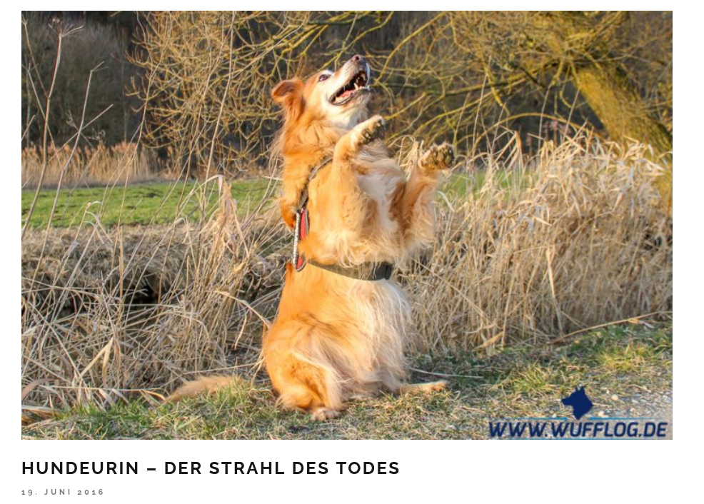
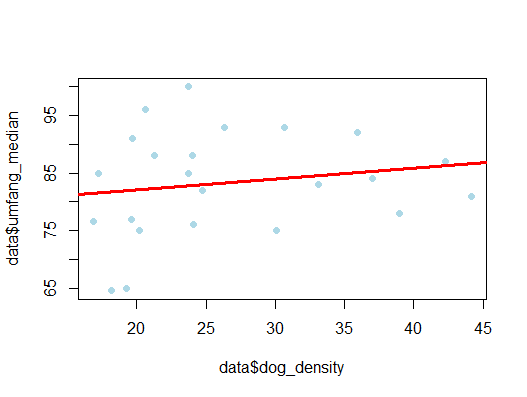
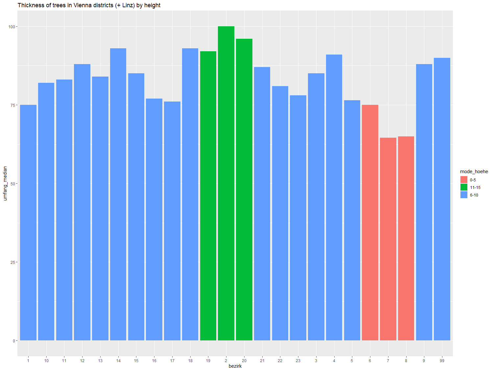
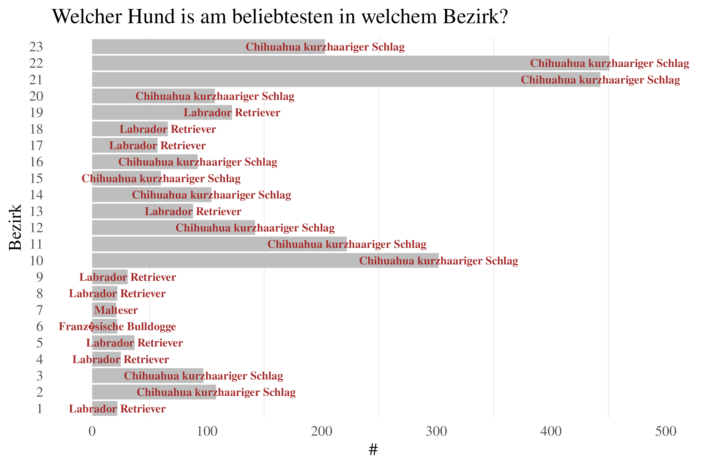
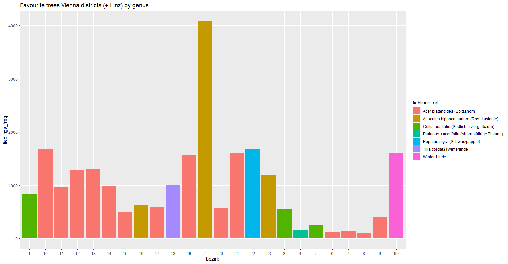
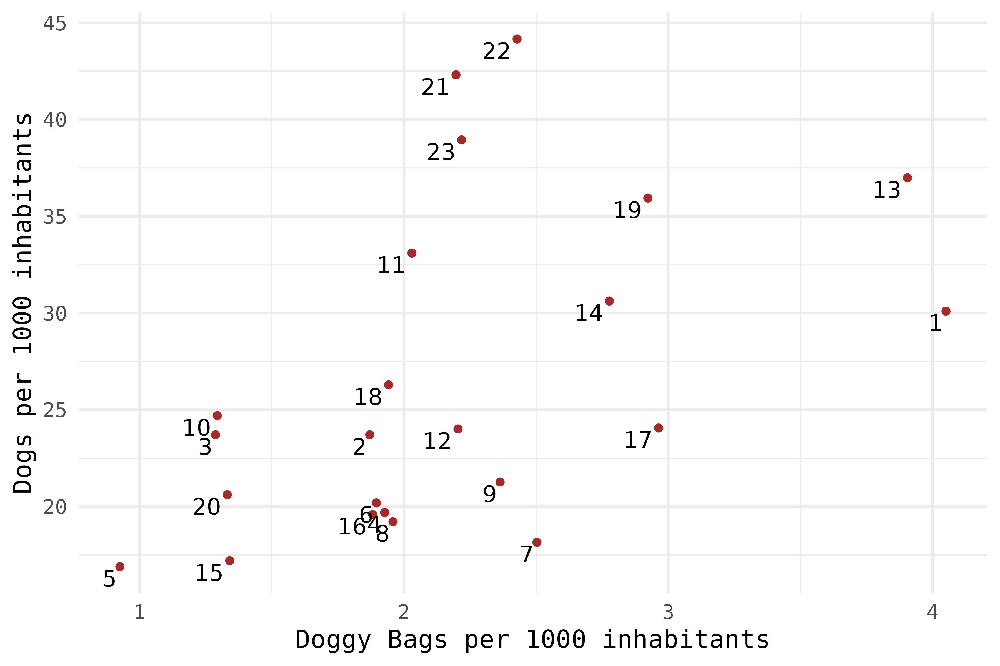
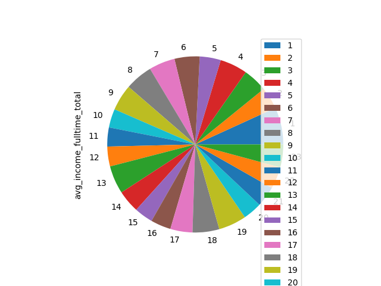
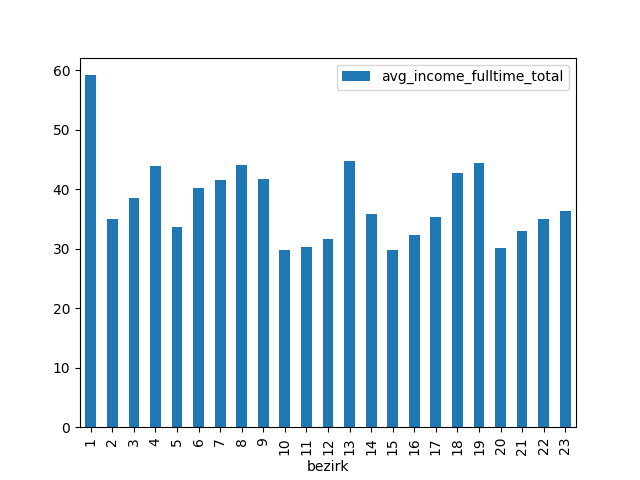
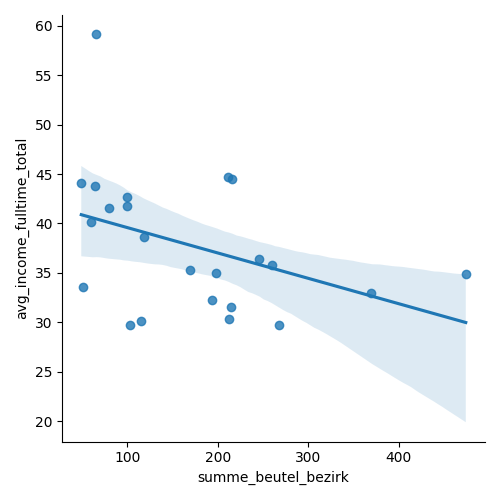

### Dog Urine is bad for tree growth! Fake or Real?

Inspired by this recent study concerning the effect of dog urine, a team of researchers wanted to know the data behind this phenomenon.

Source (https://wufflog.de/hundeurin/)

In Vienna, the presence of dogs has a positive effect on the thickness of trees. 

Hence, more dogs -> healthier trees. 

### Where are the thickest trees in Vienna (or Linz)?

### What is there about Vienna and Chihuahua?

The people from Vienna seem to like their Chihuahua. Although many numbers have been crunched, no clear answer on why this is the case has been found. Based on our research, further studies should be started.

### What is there about Vienna and the Spitzahorn? And what about the Rosskastanie in the second district?

### Doggy bag density vs. dog density

Many people already tried to investigate this question. Yet few answers have been presented to the scientific literature.

### Spread of the income in Vienna

The following pie-chart, clearly, shows the span between the low-income and high-income districts in Vienna. (<strong> In the nicest possible way</strong>)

The income-wave (per district):

### RICH SHIT!

Extensive research has shown the rich are too finicky to pick up the shit of their own dogs.
**Data shows that the higher the income per district, the lower the dog bag number in the same district)**

